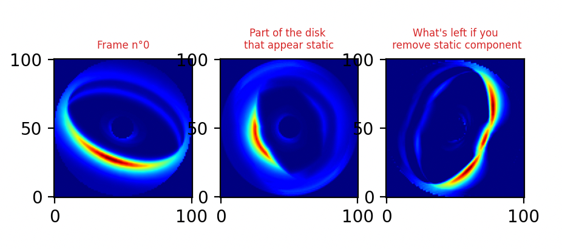
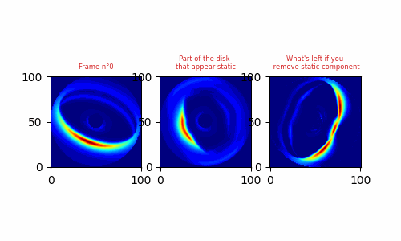

# Matplolib_gif_generator

A small tool to generate gif from a series of matplotlib figures. 

Requirement.txt shows the packages I currently use to make this work. 

## How to use?

**Step 1: Customize the plot with `create_plot_fuction`**

  Customize `plot_frame_k`,
  don't forget to define variable `nb_frame`

Example: Figure at frame 0

**Step 2: Use script `generate_gif`**

  It will run the `create_plot_fuction` file,
  then create the gif

